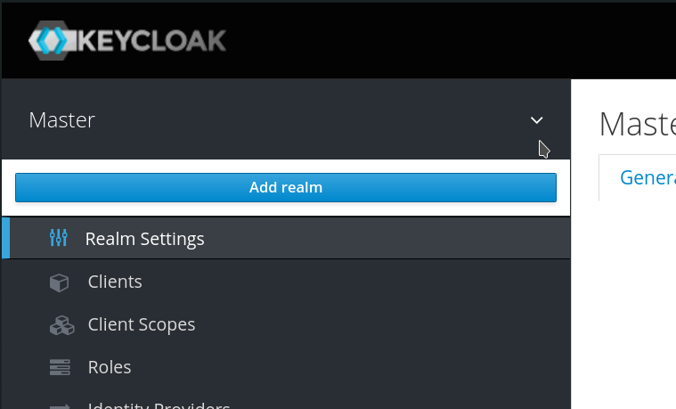

Work on these topics as a group:

- log into the Keycloak management UI
  - credentials:
    - username: admin
    - password: cst-workshop
  - Keycloak urls:
    - group 1: https://keycloak.group-1.oidc-cst-workshop.owncloud.works
    - #TODO: add more groups

- create a new realm called "ocis"
    - Read: what is a realm, https://www.keycloak.org/docs/latest/server_admin/#configuring-realms
    - HINT: hover over the "Master" realm in order to add a new realm
      

- add a user for yourself to the "ocis" realm
  - HINT: make sure, you switched to the "ocis" realm first (left upper corner needs to say "Ocis" and not "Master")
  - ensure that you set all these fields: (otherwise you can't login to oCIS later)
    - Email
    - First Name
    - Last Name
  - add a non-temporary password in the "Credentials" tab (after clicking on the user)

- inspect the well-known endpoint and what kind of information it provides
  - Keycloak has a wellknown endpoint per realm, therefore you can find it at your Keycloak url + "/auth/realms/ocis/.well-known/openid-configuration"

- add a client for the OpenID Connect debugger: https://oidcdebugger.com/
    - choose any client id
    - client protocol is "openid-connect"
    - root url is "https://oidcdebugger.com/"

- have a look at the config options of your newly created client
  - don't change the default settings for now

- try the login workflow of your newly created client with https://oidcdebugger.com/
  - get the autorization url from the wellknown endpoint ("authorization_endpoint")
  - Client ID is the one you chose in Keycloak
  - Response Type: code
  - Response Mode: Query

  - Send the request

  - On the login screen: have a look at the URL bar / query parameters

  - Use the authorization code to get a token with curl:
    - therefore get the token endpoint from the wellknown endpoint ("token_endpoint")
    - use the client id you set up
    - use this curl command `curl -X POST <token-endpoint> --data "grant_type=authorization_code" --data "code=<your code>" --data "client_id=<your-client-id>" --data "redirect_uri=https://oidcdebugger.com/debug"`
    - HINT: if you are too slow, your code expired. Just do the login flow again by pressing "Start over" in the OIDC debugger

  - you'll get an json response containing a access token

  - inspect that access token on https://jwt.io
  - HINT: don't paste production tokens anywhere because others could access them to access your data

  - HINT: if you try the login flow a second time, you won't be asked for a password anymore. This is because your user already has an active session. You can log out by navigating to your Keycloak url + "/auth/realms/ocis/account/" and clicking "sign out" in the top right corner. Alternatively navigate to the user as an Keycloak admin and log out all sessions of the user in the "sessions" tab

- access oCIS / ownCloud Web by browsing to:
  - oCIS urls:
    - Group 1: https://ocis.group-1.oidc-cst-workshop.owncloud.works
    - #TODO: add more groups

  - you'll see an error message, because we didn't set up an client for ownCloud Web yet. But we will do it in the next steps

- import following clients into the ocis realm:
  - download them from here: https://github.com/owncloud/ocis/tree/master/deployments/examples/ocis_keycloak/config/keycloak/clients
  - ownCloud Web
    - ensure the right root url!
    - ensure to replace all "https://ocis.owncloud.test" occurrences in the client (and don't miss the "Save" button on the bottom of the page)
  - Desktop Client
  - Android Client
  - iOS Client

- log into oCIS / ownCloud Web by browsing to the respective oCIS url
  - check if it worked
  - try to share a file with a colleague from your group
  - HINT: users are only available after the first login

- list user accounts in ocis:
  - ssh onto the server
    - use the oCIS url
    - username: admin
    - password: #TODO:
  - cd to /opt/..... #TODO:
  - exec into the oCIS container: `docker-compose exec ocis sh`
  - use accounts cli to list and inspect users (especially the user you originally created in Keycloak)

- dynamic client registration
  - Read: what is dynamic client registration https://curity.io/resources/learn/openid-connect-understanding-dcr/
  - allow dynamic client registration
    - go to the ocis realm settings
    - go to client registration
    - go to client registration policies
    - delete the "Trusted Hosts" policy (it is empty by default and therefore blocks all registration attempts. One could also set hostnames or IP ranges from where registration is allowed)
  - remove the desktop client oidc client (which you previously imported)
  - log in from a desktop client
  - inspect the newly created oidc client (the client id is a uuid, if you on it, the name will say "owncloud 2.xx.xx")

- impersonate as another user and use oCIS
  - ensure that your user is logged out in oCIS
  - as Keycloak admin go to the users page and klick "Impersonate"
  - open oCIS -> you should be logged in as the impersonated user
  - question: how does this work?
  - questions: does oCIS need to know about this?

- check available session timeouts for:
  - a single client
    - go to the client settings -> advanced settings
  - the whole realm
    - go to the realm settings -> tokens

  - what do these settings mean for different clients in the daily use case? Eg. the "Offline Session Idle" / "Client Offline Session Idle" or "Offline Session Max" / "Client Offline Session Max" ?

- log into the self service account management ui as your user
  - the url is your Keycloak url + "/auth/realms/ocis/account/"
  - if you have an OTP app, add a 2FA in "Account Security" -> "Signing In"
  - if you have a security key (Fido / YubiKey / ...) you need to explicitly enable WebAuthn first, see here: https://ultimatesecurity.pro/post/webauthn/. Then you can add your security key in the same section as OTP apps
